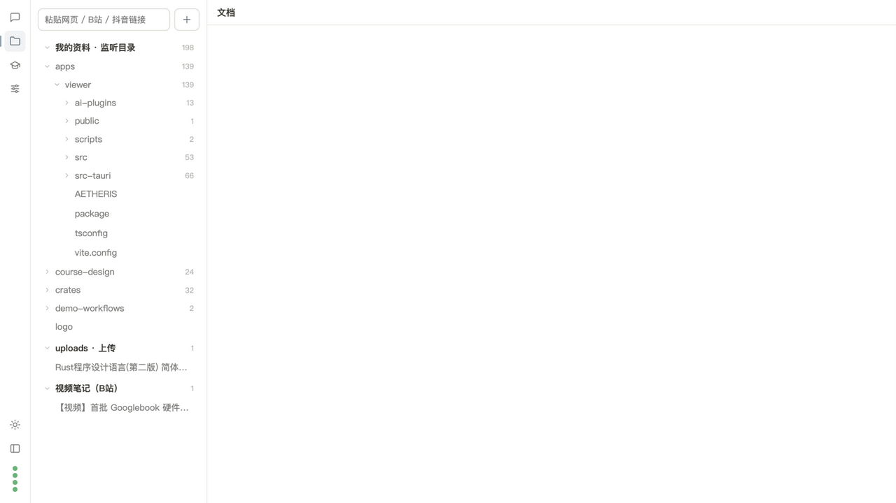
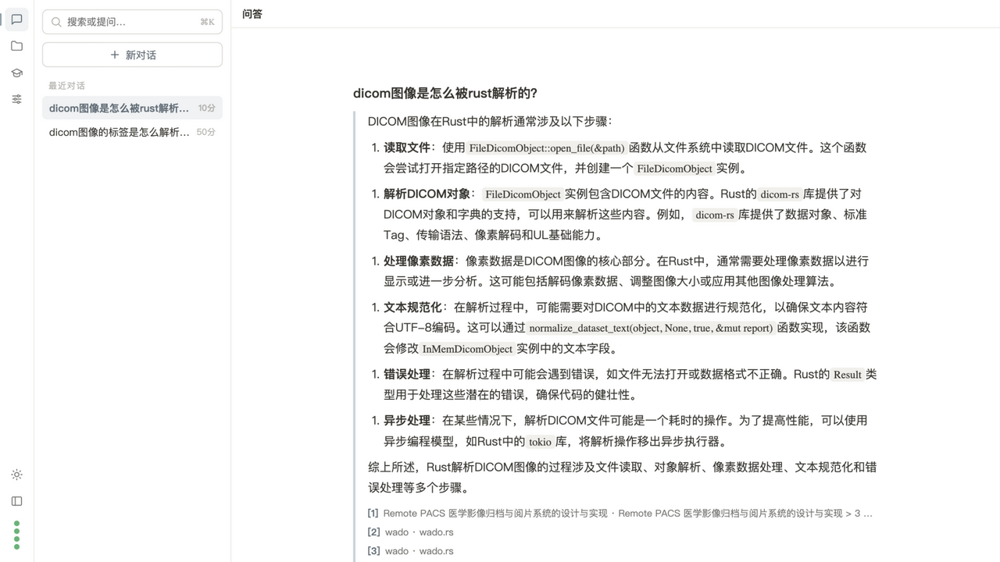
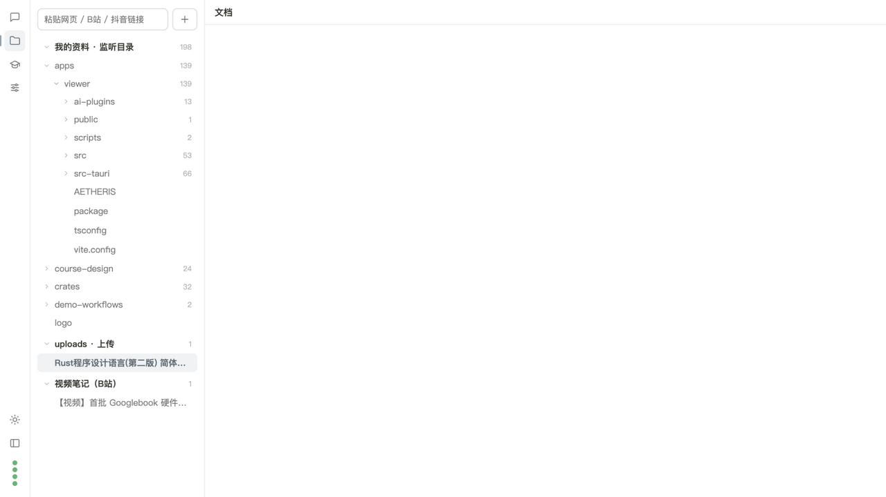
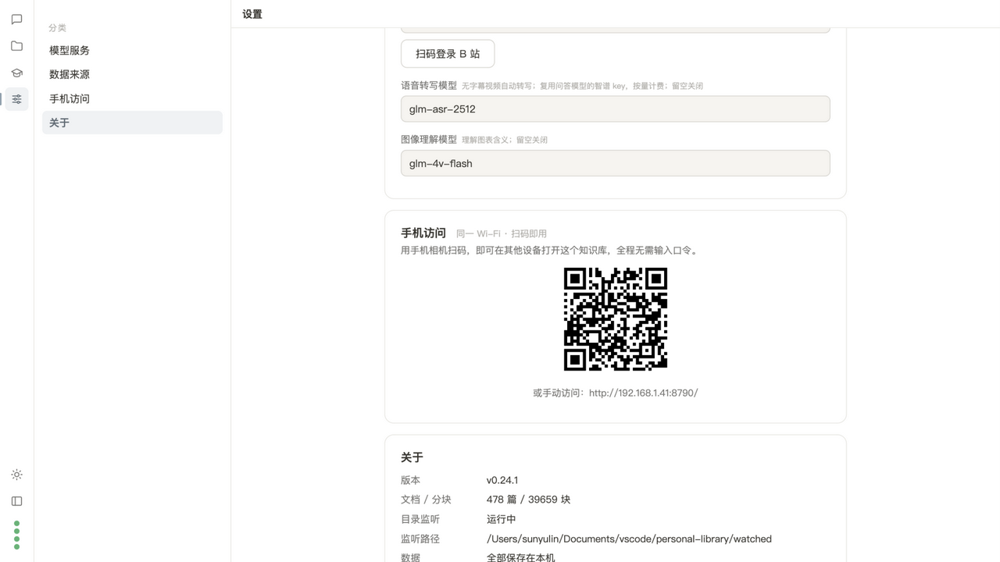

# Memo Book

<div align="center">
  
</div>

<p align="center">
  <strong>A local-first personal RAG knowledge base</strong><br />
  Automatically parses documents, code, web pages, and Bilibili videos, then answers questions with cited sources.
</p>

<p align="center">
  <a href="README.md">中文</a> · <a href="docs/DESIGN.md">Design</a> · <a href="docs/DESKTOP.md">Desktop builds</a> · <a href="docs/REQUIREMENTS.md">Requirements</a>
</p>

---

## Introduction

Memo Book is a self-hosted personal RAG knowledge base. Put your materials into a watched directory and it automatically parses, chunks, and indexes them. You can then ask questions in natural language; the answer is annotated with citation markers that link back to the exact source text.

It is designed for people who:

- Have large amounts of local PDFs, Markdown notes, saved web articles, source code, or Bilibili favorites and want unified search and Q&A;
- Care about data privacy and do not want to upload private documents to a cloud knowledge base;
- Want to freely choose model providers instead of being locked into a single vendor.

### Memo Book vs. cloud knowledge bases

| | Cloud knowledge base | Memo Book |
|---|---|---|
| Data storage | Uploaded to a third-party server | Stored entirely on your machine |
| Model choice | Usually platform-limited | Any OpenAI-compatible endpoint; Zhipu GLM by default |
| Source traceability | Not always available | Answers carry `[n]` citations that locate the original text |
| Access model | Web subscription | Local web / PWA / desktop app / HTTP API |

---

## Typical Use Cases

| Scenario | Typical input | What Memo Book offers |
|---|---|---|
| Personal notes and archives | Obsidian vault, Markdown, txt, org notes | Automatic folder ingestion, cross-note semantic search, and cited Q&A |
| Papers and books | PDFs (including scanned PDFs) | OCR / vision transcription, page-level retrieval, citations back to pages |
| Technical docs and source code | Project source, README files, code snippets | Recursive scanning that honors `.gitignore`; code chunking by function / class boundaries |
| Web and WeChat article clipping | HTML files, ordinary web pages, CSDN / WeChat article links | Body-text extraction to Markdown and unified ingestion |
| Bilibili courses and videos | Bilibili video links | Timestamped subtitle notes; speech-to-text when no subtitle exists |
| Office document management | Word / PowerPoint / Excel files | Automatic conversion to Markdown and heading-aware chunking |
| Privacy-sensitive materials | Local documents you do not want to upload to a cloud service | Data stays on your machine; only model API calls leave the host |

---

## Key Features

### Automated ingestion

- **Folder watching**: recursively watches `WATCH_DIRS` and reacts to file changes through filesystem events;
- **Clean ingestion**: skips build artifacts such as `node_modules`, `dist`, `__pycache__`, and lock files, and honors layered `.gitignore` rules;
- **Multi-format parsing**: Markdown, PDF (OCR for scanned pages), Word / PowerPoint / Excel, HTML, plain text, 23 common code extensions, and images (described by a VLM);
- **Web pages and videos**: paste normal pages / CSDN / WeChat article links for body-text extraction; Bilibili videos are converted into timestamped notes using subtitles, with speech-to-text fallback when subtitles are missing;
- **Visible parsing status**: a live queue at the top of the document tree shows per-file progress and status, and failures can be traced.

### Hybrid retrieval and cited Q&A

- **Dual-path recall**: jieba-tokenized BM25 keyword search (SQLite FTS5) plus dense vector search (Qdrant), fused with RRF in the application layer;
- **Optional reranking**: connect a SiliconFlow or compatible rerank service to improve ordering; it degrades gracefully when not configured;
- **Streaming Q&A**: answers stream over SSE and include `[n]` citation markers; sources are grouped by document in the side panel and link to the original snippets;
- **Multi-turn conversations**: follow-ups and pronoun references are supported; metadata questions such as “what documents are in my library” are answered directly from the database without spending a model call.

### Document management

- Collapsible multi-level tree that mirrors the real directory layout under watched folders;
- Automatic AI summary and three key questions after ingestion;
- Page-by-page PDF preview; Office, code, and web documents are shown as converted Markdown;
- Delete documents, force re-indexing, and inspect task states.

### Quizzes

- Generate quizzes from your library by topic: multiple choice, true/false, and short answer;
- Instant grading; short answers are scored by an LLM with feedback;
- Every question cites its source; wrong-answer review and best-score tracking are included.

### Multiple access modes and desktop builds

- Built-in **PWA** usable from any modern browser;
- Generate a QR code on the host; scanning it on your phone pairs the device with no password entry afterwards;
- **Desktop builds**: macOS / Windows packages embed the vector store and static ffmpeg, so target machines do not need Python, Docker, or ffmpeg;
- The same HTTP API can be used by scripts and AI agents.

---

## Supported Files and Input Types

### Local files

| Category | Extensions / formats |
|---|---|
| Markdown | `.md`, `.markdown` |
| PDF | `.pdf` (OCR / vision transcription for scanned pages; image descriptions can be appended for embedded figures) |
| HTML | `.html`, `.htm`, `.xhtml` |
| Plain text | `.txt`, `.text`, `.log`, `.rst`, `.org` |
| Office | `.docx` (Word), `.pptx` (PowerPoint), `.xlsx` / `.xls` (Excel) |
| Images | `.png`, `.jpg`, `.jpeg` (requires a vision model) |
| Code | `.py` `.js` `.ts` `.tsx` `.jsx` `.go` `.java` `.c` `.h` `.cpp` `.hpp` `.rs` `.rb` `.sh` `.sql` `.json` `.yaml` `.yml` `.toml` `.swift` `.kt` `.php` `.lua`, 23 extensions total |

### How code and configuration files are handled

Files such as `py`, `rs`, `c`, `cpp`, `go`, `java`, `json`, `toml`, `yaml`, `sh`, and `sql` are ingested as **plain text**: no AST / syntax-tree parsing is performed, and the system does not interpret comments, strings, or the structural semantics of JSON / TOML. They are indexed because their extensions are in the supported list, not because of a generic “txt fallback”.

However, code files receive two code-aware treatments during ingestion:

- **Structure-based chunking**: boundaries such as `def`, `class`, `func`, `function`, `fn`, `struct`, `impl`, `export`, and `async def` are recognized first, so functions / classes / structs are chunked separately when possible;
- **Line-window fallback**: files without obvious code boundaries (ordinary scripts, `.json`, `.toml`, etc.) fall back to line-window chunking with overlap, which behaves similarly to plain-text chunking;
- **Path context**: each chunk carries the file path as context, so search results can be traced back to the exact file.

This is well suited to finding and citing “which file contains this code or configuration”, but it is not intended for cross-file syntax-level analysis such as call graphs or type inference.

### Links and network inputs

- Web pages: ordinary `http(s)` HTML pages are supported, including typical CSDN and WeChat article extraction; for PDF links, download the PDF first and put it into a watched directory;
- Videos: Bilibili links are supported (`bilibili.com`, `b23.tv`, etc.). Videos with subtitles become timestamped notes; subtitle-less videos up to 15 minutes fall back to speech-to-text.

### Common unsupported formats / inputs

| Type | Reason / suggestion |
|---|---|
| Legacy Word `.doc` | Not supported; save as `.docx` instead |
| Images `.webp`, `.gif`, `.bmp`, etc. | Currently only `.png` / `.jpg` / `.jpeg` |
| Archives `.zip`, `.rar`, `.7z` | Extract them before placing into a watched directory |
| eBooks `.epub`, `.mobi`, `.azw3` | Not supported yet; convert to Markdown or PDF first |
| Local audio / video files | Not parsed directly; only Bilibili video links are supported for video notes |
| Douyin / Kuaishou links | Recognized but intentionally unsupported |
| Files with no extension / unknown binaries | Cannot determine the type and are skipped |

### Automatically ignored content

While recursively scanning watched directories, the following are skipped to avoid indexing dependencies and temporary files:

- Hidden files / directories (starting with `.`);
- Common build and dependency directories: `node_modules`, `dist`, `build`, `out`, `__pycache__`, `.venv`, `venv`, `target`, `vendor`, etc.;
- Lock and temporary files: `package-lock.json`, `yarn.lock`, `Cargo.lock`, `.DS_Store`, `*.tmp`, `*.swp`, etc.;
- Anything ignored by layered `.gitignore` rules.

---

## Screenshots

| Documents | Ask | Preview |
|---|---|---|
|  |  |  |

| Parsing queue | Quiz | Mobile pairing |
|---|---|---|
|  |  |  |

---

## Quick Start

### Option 1: Desktop build (recommended for non-developers)

Desktop builds do not require Python or Docker. See [docs/DESKTOP.md](docs/DESKTOP.md) for supported platforms, build instructions, and data directories.

- macOS: run `bash scripts/build_app.sh` locally to build the `.app` and DMG;
- Windows: push a `v*` tag and GitHub Actions produces `personal-library-win64.zip`; download it from Releases.

On first launch, a setup wizard asks you to pick a provider (Zhipu / SiliconFlow / custom OpenAI-compatible endpoint) and paste an API key.

### Option 2: Server mode (run from source)

#### Requirements

- Python 3.11+
- Docker (to run Qdrant; alternatively set `QDRANT_EMBEDDED=true` to use the embedded vector store and skip Docker)

#### Install and run

```bash
git clone https://github.com/LQ-1123/memo-book.git
cd memo-book

python3 -m venv .venv
.venv/bin/pip install -e .

# Start Qdrant (the app itself runs on the host so it can watch the real filesystem)
docker compose up -d

# Create and edit the configuration
cp .env.example .env
# Required: WATCH_DIRS, EMBED_API_KEY, LLM_API_KEY; API_KEYS protects LAN access
# Default host/port are defined in .env.example

# Start the service
.venv/bin/python -m app.main
```

Open <http://127.0.0.1:8787/> in your browser.

On macOS, `scripts/maintain.py install` registers the app as a launchd service (login autostart, crash restart, daily backups).

#### First use

1. Go to **Settings → Model providers** and enter your embedding/LLM API keys (they take effect immediately);
2. Put local documents into the `WATCH_DIRS` directories, paste a link, or upload files from the page;
3. Once parsing finishes, ask questions about your knowledge base in natural language.

---

## Configuration

Configuration can be placed in the repository root `.env`, the data directory `.env`, or edited through the web **Settings** page (hot-reloaded immediately). Common settings:

| Variable | Description | Default |
|---|---|---|
| `API_KEYS` | Access tokens, comma-separated, for multiple devices/callers | empty (recommended for server mode) |
| `WATCH_DIRS` | Watched directories, comma-separated, recursive | empty |
| `EMBED_API_KEY` | Embedding API key | empty |
| `EMBED_MODEL` / `EMBED_DIM` | Embedding model / vector dimension | `embedding-3` / `2048` |
| `LLM_API_KEY` | Q&A model API key | empty |
| `LLM_MODEL` | Q&A model name | `glm-4.6` |
| `RERANK_API_KEY` / `RERANK_MODEL` | Optional rerank service | empty / `BAAI/bge-reranker-v2-m3` |
| `QDRANT_URL` | Qdrant endpoint | `http://127.0.0.1:6333` |
| `QDRANT_EMBEDDED` | Use the embedded vector store (enabled by default on desktop) | `false` |
| `APP_HOST` / `APP_PORT` | Listen address / port | `0.0.0.0` / `8787` |
| `OCR_ENABLED` | Enable OCR for scanned documents | `true` |
| `INGEST_WORKERS` | Number of concurrent ingestion workers | `4` |
| `INGEST_ALLOW_PRIVATE_URLS` | Allow fetching internal/loopback URLs (SSRF protection) | `false` |
| `BILIBILI_SESSDATA` | Optional Bilibili login cookie for AI subtitles | empty |

The default provider is Zhipu, but the configuration layer is OpenAI-compatible. To use another vendor, override fields such as `EMBED_BASE_URL` or `LLM_BASE_URL` in `.env`. See `.env.example` and `app/config.py` for the full list.

---

## HTTP API

All API routes are prefixed with `/api/v1`. Requests from non-loopback clients must include an `X-API-Key` header containing one of the tokens from `API_KEYS`. Common endpoints:

| Method | Path | Description |
|---|---|---|
| GET | `/health` | Health check, dependency status, and index stats |
| GET | `/search?q=keyword&topk=10` | Hybrid search with source snippets |
| POST | `/ask` | Q&A; body supports `{"question":"...","stream":true,"history":[...]}`; `stream` is SSE |
| GET / POST / DELETE | `/threads` | Multi-turn conversation persistence |
| GET / DELETE | `/documents`, `/documents/{id}` | List / detail / delete documents |
| GET | `/documents/{id}/file`, `/documents/{id}/pages` | Original file and PDF page preview |
| POST | `/documents/{id}/reindex` | Rebuild a document's index |
| POST | `/ingest/url`, `/ingest/video`, `/ingest/upload` | Ingest by link / video / file |
| POST | `/ingest/reconcile` | Manual full reconciliation |
| GET | `/tasks`, `/tasks/{id}` | Ingestion task status |
| GET / PUT | `/config` | Read and hot-update runtime configuration |
| GET | `/pair/url` | LAN QR pairing URL |
| POST / GET | `/quiz` | Generate / fetch quizzes |

SSE event sequence: `sources` → `delta`* → `done`. The complete endpoint list lives under `app/api/`.

---

## How It Works

```
watched folder / URL / video / upload
        │
        ▼
 parse & chunk ──► SQLite (document registry + raw text + FTS5 index)
        │
        ▼
    embedding ──► Qdrant (dense vectors)
        │
        ▼
 BM25 + vector recall ──► RRF fusion ──► (optional) rerank
        │
        ▼
  LLM generates an answer with citations (SSE / JSON)
```

Architecture notes:

- **SQLite is the source of truth**: document registry, chunk text, FTS index, and task state live in SQLite; Qdrant stores only dense vectors and minimal payloads and can be rebuilt from SQLite at any time;
- **One ingestion pipeline**: local files, clipped web pages (saved as Markdown), video notes, and uploads all go through the same parsing pipeline for deduplication, retry, and status tracking;
- **App and vector store are separate**: watched directories must be on the host's real filesystem, so `docker-compose.yml` only runs Qdrant while the app runs directly on the host;
- **Desktop and server share the same code**: desktop builds use the embedded Qdrant and static ffmpeg to run with no system dependencies, while keeping the same features and API.

---

## Project Layout

```text
app/
  api/          # HTTP routes: documents / search / ask / ingest / quiz / threads ...
  core/         # Infrastructure: SQLite, embedding, LLM, OCR, rerank, Qdrant, VLM
  ingest/       # Ingestion pipeline: watcher, pipeline, chunking, parsers, URL/video fetch
  static/       # Frontend (vanilla-JS PWA)
docs/           # Design, requirements, desktop guide, screenshots
scripts/        # Build scripts, maintenance scripts, smoke tests
tests/          # Offline unit tests (fully mocked, no network / Qdrant)
```

---

## Development and Testing

```bash
# Install development dependencies
.venv/bin/pip install -e ".[dev]"

# Run tests (200+ offline unit tests, fully mocked)
.venv/bin/python -m pytest tests/ -q

# Run the desktop shell in development mode
.venv/bin/python run_desktop.py
```

---

## Capacity and Performance Boundaries

Memo Book is designed as a **single-machine / LAN personal knowledge base**, not a multi-tenant or enterprise online service. There is no hard-coded “maximum number of documents” limit, but the following reference boundaries are based on the design goals and current implementation:

| Dimension | Reference boundary | Notes |
|---|---|---|
| Document scale | Tens of thousands of documents, multi-GB of source data | Design target from the requirements |
| Indexed chunks | Hundreds of thousands of chunks can be searched comfortably | SQLite FTS5 + Qdrant on a single machine; 100k-level chunks are considered fine by design |
| Web / API single-file upload | ≤ 50 MB | Files larger than 50 MB should be placed directly into a watched directory instead of using the upload API |
| Single file in a watched directory | No built-in size limit | Parsing reads / converts the whole file, so very large files consume more memory and time |
| Subtitle-less Bilibili transcription | ≤ 15 minutes per video | Longer videos without subtitles cannot be ingested via speech-to-text |
| Ingestion concurrency | 4 workers by default | The bottleneck is usually embedding API latency; PDF parsing and local vector writes are serialized internally |
| Retrieval metadata filtering | Automatically falls back to post-filtering above 1,000 document IDs | Corresponds to the `_FILTER_CAP` boundary inside the retriever |
| File-event bursts | Single event queue holds about 10,000 pending events | Overflowing events are dropped, but periodic full reconciliation catches up |

Actual capacity and speed also depend on:

- Disk space, Qdrant storage location, and host memory;
- Rate limits and concurrency at your embedding / LLM provider;
- The size or page count of individual files (scanned PDFs are slower because of OCR / vision transcription);
- Whether rerank is enabled (each search then incurs one additional external rerank call).

> Recommendation: for the first import, start with a few directories to validate formats and processing time, then gradually expand. Once your library reaches hundreds of thousands of chunks, enable rerank and keep regular backups of the SQLite and vector data.

---

## Known Limitations

- Legacy `.doc` (Word 97-2003) is not supported; save it as `.docx`;
- Kuaishou videos are not supported (yt-dlp removed the corresponding extractor), and a clear error is shown;
- Subtitle-less Bilibili videos use a paid speech-to-text service (Zhipu GLM-ASR by default), capped at about 15 minutes per video;
- iOS Safari does not support PWA share-target ingestion (Android Chrome does);
- Unsigned desktop packages show a system security warning on first launch on macOS / Windows;
- For very large libraries, configuring rerank is recommended to improve ordering when similar content is abundant.

---

## Troubleshooting

- **Ingestion fails / Connection refused**: check whether Qdrant is running, e.g. `docker compose ps`;
- **Q&A returns 503 / missing key prompt**: add an API key in **Settings → Model providers**; it takes effect immediately;
- **A file never appears in the library**: check the “parsing” section at the top of the Documents page; unsupported types are silently skipped;
- **The page looks stale**: this is usually Service Worker caching; do one hard refresh;
- **The service appears hung**: run `kill -USR1 <pid>`; thread stacks are dumped to `data/logs/stack_dump.log`.

---

## License

MIT

---

*Memo Book is still in its early personal-project stage. Issues and pull requests are welcome.*
